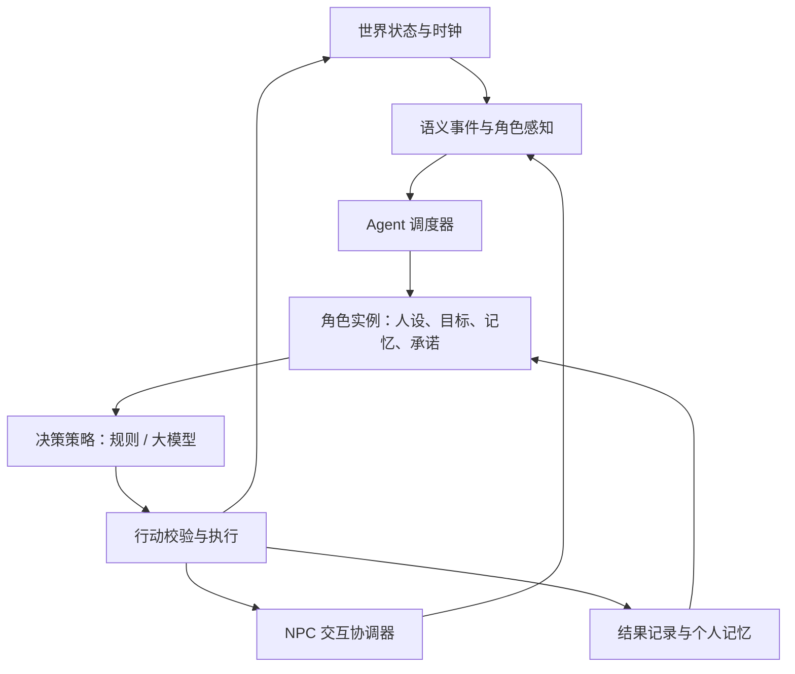

# CozyTown Agent 世界 PRD

## 1. 文档状态与工作约定

| 字段 | 值 |
| --- | --- |
| 文档版本 | v0.3，2026-09-12 |
| 状态 | 世界事件、活动仲裁和有界决策已接入；真实模型评测、社交、资源及持久化继续按地图迭代 |
| 用途 | 定义 Agent 世界的目标、需求、验收、实施依赖与研究依据，作为后续任务拆分和设计讨论的入口 |
| 本轮交付范围 | 2026-09-12 用户授权制定方案、实施、推送并继续下一阶段；第二轮处理决策调度、渐进式披露、候选检查和代理协议，实施结果由票据记录 |
| 代码参照 | `207e42c4f5962154417d7315d179bde130504a12` 及调研时的工作区；存在未提交修改，该提交不是完整运行快照 |
| 证据方法 | 调研依据一手论文、官方工程资料与源码审阅；两轮实施通过固定客户端、内存 HTTP 响应及 Unity 自动化测试，未调用真实模型 |
| 未验证内容 | 真实模型下的参数体验、实际延迟和用量、自主行为成功率、角色表现及跨日稳定性 |

本文作为专项 PRD，承接 [MVP PRD](PRD.md) 和 [NPC Agent 接入研究](research/npc-agent/decision-summary.md)。已有研究记录的首版只读对话范围保持原有含义；本文提出自主生活与行动能力的后续方向。

本文中的“应”“必须”和验收条件描述提案被采纳后的目标行为，不表示功能已经实现或用户已经确认全部范围。后续实施任务引用需求和验收编号，并明确本次覆盖的阶段。

架构选项及调用数值保留为候选设计。涉及已接受 ADR 的改变，应在相应实施任务中形成明确的新决策；本文件不静默替换 [ADR-0002](adr/0002-deterministic-domain-and-ai-boundary.md) 的现有边界。

后续头脑风暴记录在第 15 节。需求调整保留稳定编号，注明修改、替代或暂缓关系；只有明确确认的结论才标为“已确认”。

实施入口：[迭代世界与人物 Agent 的自主交互](wayfinder/agent-world/map.md)；阶段与公开测试边界见 [迭代与测试方案](wayfinder/agent-world/iteration-plan.md)。本轮启动不表示第 9 节候选参数或全部玩法细节已经确认。

任务状态、领取和依赖已迁移到 [GitHub 地图](https://github.com/qinjunw/CozyTown/issues/50)；仓库文档记录需求、决策与证据，操作见 [GitHub tracker](wayfinder/github-tracker.md)。

2026-09-12 首轮结果：独立角色状态、世界通知和临时活动已接入实际移动；共享工作区完整 EditMode 514/514、图形 PlayMode 164/164 通过。实现边界与证据见 [ADR-0015](adr/0015-resident-activity-arbitration-and-world-epochs.md) 和 [验证报告](verification/agent-world-runtime-2026-09-12.md)。首轮未接入模型决策或自主会面。

同日第二轮结果：默认休息窗口可以通过世界事件自动产生决策；调度器限制调用、并发、续调与有效期，按需披露本人已知地点，再将候选交给活动仲裁。Unity 帧更新已驱动实际人物，独立 HTTP 代理协议支持显式接入。共享工作区 EditMode 557/557、图形 PlayMode 172/172 通过；发布采用隔离检出复测，证据见[第二轮验证](verification/agent-decisions-2026-09-12.md)、[ADR-0016](adr/0016-bounded-autonomous-decisions.md) 和[代理协议](NPC_AGENT_PROTOCOL.md)。尚无代理服务端、真实模型评测、社交承诺或资源协作实现。

## 2. 产品定义、目标与范围

### 2.1 问题与方向

本轮讨论从“如何管理每个角色的 Agent”扩展到以下问题：

1. Agent 驱动的世界应该具备哪些行为？
2. 基类与派生类是否足以组织角色？
3. 每个角色何时调用模型，如何限制频率和并发？
4. NPC 如何自主发现彼此、发起交互并履行约定？
5. 游戏应向模型暴露哪些行动接口？
6. 没有玩家自然语言命令时，如何自动唤醒内置 Agent，并渐进式提供上下文？

研究建议是：以现有确定性游戏规则为基础，增加事件驱动的角色运行时、独立角色状态、有界模型决策和可验证的行动及社交协议。

| 问题 | 建议的责任归属 |
| --- | --- |
| 什么时候需要思考 | 世界事件、需求变化、承诺期限和调度器 |
| 角色知道什么 | 感知范围、已知事实、个人记忆和上下文构建 |
| 角色想做什么 | 人设、持续动机、当前目标、计划和决策策略 |
| 世界实际发生什么 | 游戏规则、资源检查、行动执行和结果记录 |

基类可以提供共享生命周期；角色差异主要通过配置和能力组合表达。继承关系本身无法解决资源争用、赴约、调用预算或迟到响应等运行问题。

### 2.2 目标用户与使用场景

- 玩家或观察者：没有逐次下指令时，也能看到 NPC 开展活动、与他人交互并受到经历影响。
- 内容设计者：通过人设、动机、日程和能力配置调整人物行为，而不为每个人复制一套运行逻辑。
- 开发与评测人员：能够追溯一次自主行为的触发、上下文、决策、执行和失败原因。

| 用例 | 期望行为 |
| --- | --- |
| AW-UC-01 自主见面 | 玩家不输入指令，两名 NPC 因内置事件发起邀请、赴约、交谈并恢复生活 |
| AW-UC-02 资源协作 | Sora 因缺料联系 Ren，双方接受条件后实际交付；拒绝或失败时调整安排 |
| AW-UC-03 故障下继续生活 | 模型超时或预算耗尽后，角色继续合法活动，互动在有限时间内结束 |
| AW-UC-04 查看角色状态 | 开发者查看角色目标、承诺、已知信息和执行结果，定位异常所属环节 |

### 2.3 产品目标

| 目标 | 可观察结果 | 对应验收 |
| --- | --- | --- |
| AW-G-01 自动运行 | 内置事件能启动并完成一次角色活动，无需人工自然语言触发 | AW-AC-01 |
| AW-G-02 角色差异与连续性 | 人设、承诺和真实经历进入后续选择；四人状态互不串用 | AW-AC-02、AW-AC-06 |
| AW-G-03 有序协作 | 邀请、赴约、交付与失败都有明确结果，资源和控制权不冲突 | AW-AC-03、AW-AC-04、AW-AC-08 |
| AW-G-04 有界运行 | 网络故障、重复事件、读档及跳时不造成无限调用或旧结果污染 | AW-AC-05、AW-AC-07 |
| AW-G-05 可解释与可评测 | 观察者能核对角色为何行动以及实际结果 | AW-AC-09 |

### 2.4 候选交付范围

首个行为闭环采用两名 NPC，其后扩展到 Mina、Eli、Ren、Sora 四人。复用现有小镇、时间、路线、生产和经济规则。

| 范围 | 内容 |
| --- | --- |
| 首个闭环 | 独立角色状态、内置触发、计划仲裁、受限移动与社交、事件记忆、故障回退和诊断 |
| 后续扩展 | NPC 自有资源及一次真实协作、四人差异、跨日运行、随存档恢复的状态与承诺 |
| 本提案暂不纳入 | 多人联网、千人社会模拟、模型任意改写价格／配方／掉落规则、任意代码执行、每角色独立服务部署 |
| 等待讨论 | 新需求系统的复杂度、关系变化玩法、玩家打断规则、时间倍率、记忆保留范围、模型与部署方案 |

## 3. 功能与运行需求

需求目前均为提案。P0 表示首个自主闭环的必要条件；P1 表示后续完整四人世界的扩展要求，不代表已经排期。阶段定义见第 13 节。

| ID | 优先级／阶段 | 需求 | 验收 |
| --- | --- | --- | --- |
| AW-FR-001 | P0／M1 | 每个 NPC 有稳定身份及可独立配置的人设、偏好和能力；共享机制不要求按人物复制实现。 | AC-02 |
| AW-FR-002 | P0／M1 | 每个角色独立持有目标、当前行动、收件事件和承诺；隐藏场景身体不删除其逻辑状态。 | AC-02、AC-07 |
| AW-FR-003 | P0／M1 | 日程、需求、行动结果和社交事件可自动生成决策任务；先进行相关性筛选、去重、冷却与队列控制。 | AC-01、AC-05 |
| AW-FR-004 | P0／M1 | 日程、临时目标与已接受承诺经过单一行动仲裁入口，同一角色的身体只有一个当前控制者。 | AC-03 |
| AW-FR-005 | P0／M2 | 模型请求受全局预算、角色并发、总时限及轮次限制；工具续调、重试和反思统一计量。 | AC-05 |
| AW-FR-006 | P0／M2 | 上下文按角色感知和权限构建；基础信息自动提供，细节按需展开，必要约束始终可见。 | AC-06 |
| AW-FR-007 | P0／M2 | 模型提出注册过的行动候选，由游戏检查权限和前置条件；区分受理、完成和失败，重复请求不重复生效。 | AC-03 |
| AW-FR-008 | P0／M3 | NPC 交互包含提议、回应、赴约、轮次和结束状态；拒绝、超时、取消与失败能释放占用。 | AC-01、AC-04 |
| AW-FR-009 | P0／M3 | 接受邀请后登记结构化承诺并进入计划；资源协作阶段扩展到交付条件，语言表达不直接代表承诺完成。 | AC-04 |
| AW-FR-010 | P0／M3 | 记录实际活动及对话事件，区分观察、转述和推测；失败或未发生的行动不记为已完成事实。 | AC-06 |
| AW-FR-011 | P1／M4 | NPC 经济行为使用明确归属的资源；交付与交易原子更新，生产依照已有规则计算。 | AC-08 |
| AW-FR-012 | P0／M1–M3 | 暂停、跳时、读档和世界重建有明确处理；旧运行代次的响应不能写入当前计划、记忆或资产。 | AC-07 |
| AW-FR-013 | P0／M2–M3 | 模型不可用时，角色继续默认合法活动；进行中的等待和交互按配置终止或恢复。 | AC-05 |
| AW-FR-014 | P0／M1–M3 | 管理视图与记录关联触发事件、角色、请求、行动及结果，并展示预算和回退原因。 | AC-09 |
| AW-FR-015 | P1／M5 | 用四个人物的固定场景比较行为差异、记忆影响和跨日表现，记录无效重复规划及调用效率。 | AC-02、AC-09 |
| AW-FR-016 | P1／M5 | 明确随存档恢复的目标、记忆和承诺，定义进行中行动的恢复／取消及旧格式兼容策略。 | AC-07 |

上表验收缩写 `AC-xx` 均指 `AW-AC-xx`。延迟、用量和体验通过率尚无实测依据；第 9 节数值只能作为实验配置，不能直接写成达标结论。

## 4. 调研基线与约束

本节记录 2026-09-11 调研时的代码状态，行号对应当时工作区。此后的运行基础变更与测试结果通过 [实施地图](wayfinder/agent-world/map.md) 追踪。

### 4.1 可复用能力及缺口

| 代码事实 | 对自主世界的影响 | 源码依据 |
| --- | --- | --- |
| 已有四个稳定 NPC 身份及独立人设、回退台词 | 可作为角色注册表的静态配置来源 | [DefaultMvpContent.asset](../Assets/CozyTown/Content/DefaultMvpContent.asset)，第 21 行起 |
| 对话上下文中的好感度为 `0`，近期活动和记忆为空数组 | 尚不能依靠正式对话路径形成持续个人经历 | [NpcContentCatalog.cs](../Assets/CozyTown/Runtime/Npc/NpcContentCatalog.cs)，`CreateDialogueContext` |
| 组合根创建共享对话协调器及生成器 | 可以复用模型适配边界；仍需独立角色状态和自动调度 | [CozyTownCompositionRoot.cs](../Assets/CozyTown/Runtime/Core/CozyTownCompositionRoot.cs)，第 144 行起 |
| NPC 日程直接设置移动目的地 | 新行动必须与日程经过同一入口仲裁，否则目的地会被覆盖 | [NpcWorldResident2D.cs](../Assets/CozyTown/Unity/Npc/NpcWorldResident2D.cs)，`SetTarget` |
| 默认经济初始化只有玩家；生产服务使用玩家库存适配器 | NPC 生产、交付前需要明确自己的库存、资金及资源归属 | [CozyTownCompositionRoot.cs](../Assets/CozyTown/Runtime/Core/CozyTownCompositionRoot.cs)，第 93–140 行 |
| 1 游戏分钟对应 0.5 现实秒 | 连续运行且不暂停、不跳时时，一天约 12 现实分钟 | [IWorldTimeFlow.cs](../Assets/CozyTown/Runtime/Time/IWorldTimeFlow.cs)，`EffectiveSecondsPerGameMinute` |
| 开发场景中的代理超时配置为 8 秒，默认端点为空 | 超时窗口相当于 16 游戏分钟；这不是实测延迟，实际启动配置仍可能被覆盖 | [CozyTown_Dev.unity](../Assets/CozyTown/Scenes/CozyTown_Dev.unity)，`_aiProxyTimeoutSeconds`、`_aiProxyEndpoint` |

默认日程配置中，Ren 的休息时间是 12:15–13:15，Sora 是 13:00–14:00，交集只有 15 游戏分钟，即 7.5 现实秒，且各有自己的休息地点。这说明偶然接近不足以保证他们能完成一次需要模型回复的互动。该计算依据 [CozyTownTownLifeSceneUpgrader.cs](../Assets/CozyTown/Unity/Editor/CozyTownTownLifeSceneUpgrader.cs) 的默认配置，不是运行时见面成功率测量。

### 4.2 现有人设与候选扩展

以下“建议补充”尚未成为角色设定，等待后续讨论。

| 角色 | 当前人设含义 | 建议补充的决策依据 |
| --- | --- | --- |
| Mina | 务实、友善、重视公平交易的店主 | 经营目标、最低库存、交易底线、帮助熟人的条件 |
| Eli | 有耐心，能简单解释种植的农夫 | 农务优先级、分享知识的意愿、接受打断的条件 |
| Ren | 安静，留意池塘细微变化的渔夫 | 社交主动程度、工作边界、值得分享的发现 |
| Sora | 活跃，喜欢组合当地食材的厨师 | 菜谱目标、尝新偏好、缺料时的取舍、邀请品尝的动机 |

每个人物建议分开保存三类信息：

- **稳定设定**：身份、价值观、偏好、表达风格、职业能力。
- **动态状态**：需求、资源、目标、当前行动、已接受的承诺。
- **个人经历**：观察、收到的消息、实际行为结果及其来源和时间。

亲眼所见、他人转述和角色推测应有来源区别。角色可以误解或持有过时认识；库存、位置和交付等权威状态仍以游戏执行结果为准。

## 5. 研究依据与证据边界

| 来源 | 展示的能力 | 已知边界与本项目启示 |
| --- | --- | --- |
| Generative Agents，2023，论文 v2 | 25 个角色通过观察、记忆、规划和反思产生信息传播、社交与集体活动 | 派对意图有人工初始设置。12 人受邀、5 人赴约；另有 4 人表示感兴趣但没有把赴约纳入行动计划。需要显式承诺与执行状态。[R1] |
| Concordia，2023，论文 v1 | 通过组件组织角色状态与决策，将行动意图交由环境解释和裁定 | 支持组件组合及意图／结果分离的设计方向，不能替代具体游戏的资源规则。[R2] |
| Voyager，2023，论文 v2 | 根据环境和已有进展自动提出任务，复用技能，并利用执行反馈调整 | 仍会提出不可能的行为、卡住或错误自检。可借鉴自动任务来源和反馈循环；本项目的执行能力应对应注册过的游戏行为。[R3] |
| Project Sid，2024，论文 v1 | 探索大量角色的协作和社会行为 | 论文报告千人规模出现间歇性无响应；文化传播分析采用一次 500 人运行。规模展示不足以证明长期稳定运行。[R4] |

这些材料支持“角色可以在初始目标和世界机制下自主开展活动”的可行性。长期秩序、角色差异及玩家体验，仍需要在 CozyTown 的规则、时间倍率和模型条件下验证。

## 6. 核心生活循环与内容设计

候选目标场景：Sora 准备晚餐时发现缺鱼，考虑向 Ren 获取、改换菜谱或推迟准备。Ren 根据自己的安排决定是否帮忙。实际交付完成后，库存、承诺和记忆更新，并影响次日行为。

支撑该场景的世界机制包括：

1. **稳定生活节奏**：工作、休息、进食、公共活动等时间结构。
2. **持续动机**：职业任务、需求、个人偏好和社会关系产生目标来源。
3. **能力与资源差异**：不同职业提供不同物品、知识或服务，形成联系他人的理由。
4. **行动约束**：地点、时间、库存、参与者和活动容量影响选择。
5. **可持续后果**：承诺、合作与失败成为之后决策的输入。
6. **失败后的恢复**：超时、缺料、拒绝或不可达后，能够取消、改期或选择替代方案。

初始动机和可行世界规则需要由开发者定义；运行时根据变化自动生成具体任务。模型可提出候选目标，但其成本和可执行性要经过检查。

整理摊位、观察池塘、等待和转身问候等表现可以由规则和动画持续推进。模型主要参与会改变计划、关系或表达内容的选择。

## 7. 角色组织与管理模块

### 7.1 候选组织方式

| 方案 | 适用点 | 限制或代价 |
| --- | --- | --- |
| 按人物或职业逐层继承 | 可快速共享生命周期和少量固定行为 | 多职业、跨职业能力和相同运行机制容易形成重复或复杂继承关系 |
| 共享角色运行时，组合人设、状态和能力 | 四个角色可独立生活，又能复用移动、记忆、社交和模型客户端 | 需要明确状态归属及组件之间的调用边界 |
| 每角色独立外部服务 | 可隔离部署、资源和故障 | 增加网络、一致性和运行管理成本；当前研究未发现四人版本必须采用的证据 |

候选方案采用第二种。`NpcAgent` 可以保留很薄的生命周期和身份入口；职业与人设以配置表达，只有确实不同的运行机制才引入派生类型。

每个角色实例建议持有：`Profile`、`State`、`Memory`、`Goals/Plan`、`Commitments`、`Inbox`、`Capabilities` 和 `DecisionPolicy`。这些是职责划分，具体实现不要求每项都成为独立类或服务。

### 7.2 运行关系



| 管理职责 | 内容 |
| --- | --- |
| 角色注册与状态生命周期 | 按稳定 NPC ID 获取实例；保存目标、记忆和承诺 |
| 决策调度 | 合并事件，按优先级、冷却、并发和预算安排请求 |
| 上下文构建 | 根据角色实际已知信息形成决策输入 |
| 行动协调 | 在日程、临时目标与已接受承诺之间确定当前行动 |
| 社交协调 | 管理邀请、赴约、发言、结束和失败清理 |

四个角色可共享一个模型客户端，各自持有独立状态。场景物体承担呈现和执行；角色隐藏或离开当前画面时，状态仍由世界管理。

移动目的地需要单一仲裁入口。既有日程可以作为默认计划，经过仲裁后再交给已有路线跟随器，避免多个模块同时控制身体。

### 7.3 管理与诊断视图

候选角色检查面板应展示：人设版本、当前需求和目标、当前行动、下一项承诺、最近触发事件、已披露信息、相关记忆、模型请求及执行结果。

诊断记录应能沿着同一事件追踪：为何唤醒、为何调用或跳过模型、选择了什么、校验是否通过、世界最后改变了什么。角色生成的简短决策说明可以作为辅助，不能替代实际工具轨迹和结果。

## 8. 自动触发：从世界变化生成决策任务

### 8.1 触发来源

| 触发来源 | 示例 | 默认处理 |
| --- | --- | --- |
| 日程边界 | 开店、下班、进入休息时段 | 已有明确计划则直接执行 |
| 需求跨越阈值 | 食材不足、疲劳达到休息阈值 | 产生或调整目标 |
| 行动完成或失败 | 到达、制作完成、交易失败、不可达 | 继续计划，必要时重新决策 |
| 定向社交事件 | 邀请、请求、报价、回复 | 检查资格与状态，再决定是否回应 |
| 环境机会 | 遇见熟人、发现资源、公共活动开始 | 检查相关性及打断条件 |
| 承诺临近或到期 | 见面时间临近、交付期限到达 | 提前安排或处理冲突 |
| 空闲检查 | 长时间无行动且无等待任务 | 检查遗漏目标或恢复失败状态 |

候选触发链：

```text
Sora 到备餐时间
  → 代码检查当前食材，发现目标受阻
  → 创建“解决备餐缺料”的决策任务
  → 提供相关事实、现有承诺和候选能力
  → 模型选择找人、替代菜谱或调整安排
  → 游戏校验并启动行动
  → 行动结果触发计划继续或重新规划
```

内部提示词由系统根据结构化事件生成，无需玩家逐次输入自然语言。事件驱动行为树同样通过相关状态变化触发重新评估，并由具体任务持续执行，可作为调度机制的参考。[R5]

### 8.2 进入模型前的过滤

- 感知与权限过滤：只投递角色能观察到或经合法渠道收到的事件。
- 去重与合并：同一批库存变化形成一个相关事件，重复邀请合并处理。
- 阈值与冷却：只有需求跨过阈值或发生足够变化才重新触发，减少边界抖动。
- 计划检查：已有明确下一步时由代码继续执行。
- 打断检查：普通机会进入待处理队列，紧急事件按规则中断可取消行动。
- 预算检查：调用次数、总时限、队列容量和事件有效期满足条件才发出请求。

世界时钟的连续更新需要先转换为日程边界、期限到达等语义事件。模型请求应订阅这些语义事件，而不是直接跟随每次时间更新。

## 9. 调用节奏、预算与时间语义

### 9.1 初始实验参数

以下数值是四人版本的候选实验起点，未通过性能或体验测试。

| 层级 | 候选节奏 | 模型参与 |
| --- | --- | --- |
| 移动、动画、行动推进 | 跟随游戏更新 | 无 |
| 需求与机会检查 | 语义事件触发，辅以每 0.5–2 现实秒轻量检查 | 无 |
| 日常规划与重新规划 | 有相关事件时才考虑；普通自主决策冷却 30–60 现实秒 | 按需 |
| 社交回复 | 收到有效会话轮次后调度 | 按需，受会话预算限制 |
| 记忆整理与反思 | 重要事件积累后，或一天结束时 | 按需；无新内容可跳过 |

候选全局预算：每现实分钟最多 8 次实际模型请求，同时最多 2 次。每个 NPC 同时最多一个会改变行动计划的决策请求；一次决策最多两次模型往返，一次偶遇先限制为 2–4 个发言回合。工具续调、重试、反思均计入全局请求预算。

冷却规定最短间隔，不要求到点调用。社交回复使用独立优先级，不受普通日常规划冷却阻塞，但仍受全局预算、回合数及会话有效期约束。应错开角色的日常规划，并为等待较久的任务增加优先级，防止单个角色长期占用预算。

对比计算：四个 NPC 每 5 秒各调用一次，会产生每分钟 48 次、每小时 2,880 次请求，尚未计入工具续调。连续运行且不跳时时，8 次／分钟的上限对应每个游戏日最多 96 次；该上限不代表角色必然用满预算。

### 9.2 三类时间

| 时间 | 管理对象 |
| --- | --- |
| 游戏时间 | 日程、生产、约定和角色需求进展 |
| 现实时间 | 网络超时、请求速率和并发控制 |
| 行动有效期 | 当前邀请、报价、资源预约和决策机会 |

需要根据实测响应时间为社交安排提前量及停留窗口。当前 8 秒超时配置不能直接作为平均延迟，也不能据此认定任何特定模型能够在窗口内回复。

### 9.3 迟到响应、暂停和跳时

- 模型等待期间，世界继续执行当前合法行动或默认活动。
- 返回结果校验世界运行代次、相关对象状态、资源预约及期限。普通时钟前进不应让所有决策一律失效。
- 同一角色在等待期间若发生重大计划改变，旧决策失效；执行前仍需检查当前前置条件。
- 暂停时停止游戏时间相关推进；现实网络超时仍可能到期。待处理响应的应用时机应由运行时统一管理。
- 读档或重建世界后使旧请求失效，恢复或取消承诺，防止旧时间线信息写入新状态。
- 睡觉跳时后合并待处理事件，处理错过的约定，避免补发整夜逐时请求。
- 请求预算不足或模型失败时，执行明确回退；等待和重试均应有上限。

## 10. NPC 交互：机会、承诺和会话协议

### 10.1 为互动提供可达机会

候选机制包括共同休息区、饭点、集市等共享活动窗口；职业需求产生的找人行为；提前约定的地点与时间；带容量和时限的活动位置。

Smart Objects 的查询、预约、使用和释放机制可作为活动位置管理的参考：角色发现可用位置后先获得占用资格，再前往使用，结束或失败时释放。[R6]

稳定触发的验收含义是“有效机会进入流程，并在有限时间内得到结果”。拒绝、改期和执行失败属于可解释的结果，不能靠强制所有邀请成功来证明稳定性。

### 10.2 候选状态机

```text
提出邀请 → 接受 → 安排赴约 → 双方到达 → 开始互动 → 完成
    └──────── 拒绝 / 改期 / 超时 / 取消 / 失败 ────────┘
```

| 规则 | 解决的问题 |
| --- | --- |
| 每次互动有稳定 ID；双向重复邀请合并 | 避免 A、B 同时发起两场互相冲突的会话 |
| 一个角色同时只参加一个占用身体和注意力的互动 | 避免多方同时控制同一角色 |
| 接受时为双方登记承诺，并检查日程和资源冲突 | 让“愿意参加”进入实际行动计划 |
| 参与者和地点预约具有期限；失败释放占用 | 避免永久等待和资源泄漏 |
| 按轮次发言，限制回合数和持续时间 | 避免模型之间无限往返 |
| 完成后记录真实结果，再形成双方个人记忆 | 避免把未执行的语言承诺记成事实 |

模型可提出接受、拒绝、改期或具体条件；交互协调器负责合法状态迁移。耗时模型调用期间不持有无限期锁，双方接受后还需原子检查冲突并登记承诺。

### 10.3 事件投递与失败处理

A 发出邀请后进入受控等待或继续允许的活动；B 的决定通过事件返回，再由协调器推进会话。角色之间采用异步事件投递，避免互相同步等待。Actor 调度官方资料展示了交叉等待形成死锁的情况，可作为这一约束的工程依据。[R7]

同一对角色应有交互冷却；一条事件引发的后续消息应有有效期和数量限制。资源竞争、对方离开、路径失败或服务中断都需要明确结束或改期路径。

## 11. 给模型的行动接口

以下为能力族及接口示意，不是已经实现的 API。调用主体、世界运行代次、请求 ID 和权限由可信运行时绑定。

| 能力 | 接口示意 | 游戏端检查 |
| --- | --- | --- |
| 查看信息 | `inspect(entityId, facet)` | 可见范围、已知对象、信息权限 |
| 检索个人记忆 | `recall(topic, limit)` | 记忆归属、来源和数量 |
| 前往地点 | `move_to(locationId)` | 目标有效、路径及当前行动的中断条件 |
| 执行活动 | `perform_activity(activityId, targetId, args)` | 已注册活动、类型化参数、能力、资源、地点和前置条件 |
| 提议互动 | `propose_interaction(targetId, kind, terms)` | 对象资格、冷却、时段和条件 |
| 回应互动 | `respond_interaction(id, decision, terms)` | 回应权限、提议有效性和冲突 |
| 会话发言 | `say(interactionId, content)` | 轮次、参与者和会话状态 |
| 撤销行动 | `cancel_action(actionId)` | 行动归属、中断规则与资源清理 |

`perform_activity` 对应注册过的具体行为及参数结构，例如烹饪已有菜谱。模型可以组合允许的行为，但不能用任意文本创建可执行代码、菜谱或资源规则。

涉及交易时，报价、接受条件与实际转移需要结构化契约；双方资产经检查后一起提交。掉落和随机产出仍由游戏规则计算，模型不能填写随机结果来指定收益。

行动返回需要区分：

```text
Accepted：请求已受理，返回 actionId，执行尚未完成。
Completed：行动实际完成，返回结果及相关状态变化。
Failed：行动失败，返回稳定错误码和相关当前事实。
```

“已开始前往商店”与“已到达商店”应产生不同事件。网络重试使用同一命令身份去重，避免重复扣款、生成物品或登记承诺。

自然语言承担表达；资源、预约和交付由结构化行动改变。NPC 表示“送出了一条鱼”时，交付成功记录才是更新库存和完成承诺的依据。

## 12. 渐进式披露与自动唤醒的衔接

触发器决定何时产生决策任务；上下文构建器决定本次披露哪些信息。两者分别实现后可以组合使用。

| 层级 | 内容 | 提供时机 |
| --- | --- | --- |
| 基础上下文 | 身份、当前目标、已接受承诺、触发原因和必要规则 | 每次决策 |
| 当前候选 | 附近或已知的相关对象、少量可用行动及简要说明 | 程序根据事件和能力自动筛选 |
| 按需详情 | 具体对象状态、菜谱、相关记忆及完整工具参数 | 模型选中方向后查询 |

Sora 缺鱼时，初始上下文提供缺料事实、备餐期限、既有承诺和相关选项。她选择改菜谱后才展开候选材料；选择联系 Ren 后才读取相关已知信息与记忆；行动提交后返回其结果。

上下文工程资料支持按需获取相关细节；工具发现资料也指出，工具少时引入额外搜索会增加延迟。[R8]、[R9]

四人版本的候选起点是“程序筛选相关能力 + 按需展开详情”。职业和工具数量增加后，再根据上下文长度和工具选择错误评估是否引入检索。

必要的当前约束应随决策提供，不能全部隐藏在待检索资料中。披露范围与执行权限分别校验：工具是否出现在上下文里，不决定它是否有权执行。

## 13. 实施路线与验收

### 13.1 阶段、依赖与完成条件

以下用于后续拆分任务，不是本轮实施清单。每个任务记录覆盖的 `AW-FR`、`AW-AC`、采用的决策及验证结果。

| 阶段 | 依赖与交付内容 | 完成条件 |
| --- | --- | --- |
| M0 范围与契约 | 明确首个角色组合、生活场景、行动权限及生命周期；处理第 14 节相关决策 | 本次实施范围和验收明确，与既有 ADR 的冲突有记录 |
| M1 角色运行时 | M0；独立状态、事件队列、日程仲裁、运行代次和基础诊断 | 固定策略下自动行动、角色隔离、旧响应失效及控制权检查通过 |
| M2 决策与执行边界 | M1；固定模型替身、预算、上下文披露、行动结果与回退 | 非法候选、重复请求、超时、预算耗尽场景均得到预期结果 |
| M3 两人自主见面 | M2；共享机会、邀请协议、承诺、赴约、对话和事件记忆 | AW-UC-01、AW-UC-03 闭环成立；占用能够正常释放 |
| M4 真实资源协作 | M3 及 NPC 资源归属契约；请求条件与交付 | AW-UC-02 实际更新双方状态，失败无部分转移，重试无重复产出 |
| M5 四人与持久化评测 | M3；涉及经济场景时依赖 M4；补齐四人差异、存档契约和多次运行评测 | 提供模型／配置版本、成功与失败原始计数、跨日记录及读档验证 |

真实模型接入时遵循现有 [MVP PRD](PRD.md) 和 [测试计划](TEST_PLAN.md) 中适用的场景验收要求，并记录其当前状态。固定替身验证与真实模型表现分别报告；外部框架、模型和部署方式由后续选型任务确定。

首个候选验收场景：玩家不发指令，两名 NPC 因内置事件决定见面，实际完成互动、留下记忆并返回生活；其中一次模型请求失败时，流程仍能在有限时间内结束。

### 13.2 行为验收条件

以下是提案的验收契约；固定场景应使用可控替身验证明确结果，真实模型另记录多次运行表现。

| ID | 前提与触发 | 必须观察到的结果 |
| --- | --- | --- |
| AW-AC-01 | 两名角色具有可达共同地点、有效空闲窗口；内置事件触发且固定策略选择接受 | 无玩家输入也能完成邀请、赴约、互动、记忆和恢复日程；每一步有事件或执行记录 |
| AW-AC-02 | 四个角色使用独立配置；修改其中一个角色的状态，并运行人物对照场景 | 其他角色状态不被改写；配置和经历进入相应角色上下文，行为差异有记录可评估 |
| AW-AC-03 | 已有日程移动时收到合法临时行动；随后返回迟到或重复命令 | 当前身体始终只有一个控制者，旧日程不覆盖已选行动；非法／过期／重复命令不产生额外效果 |
| AW-AC-04 | 双向邀请、多方争用或一方取消／离开／超时 | 同一互动去重，每人仅参加一个占用注意力的会话；流程进入终态，参与者和地点占用释放 |
| AW-AC-05 | 注入重复事件、慢响应、断线、非法输出及预算耗尽 | 实际请求数、并发和轮次不突破配置；世界继续更新，角色按规则回退，等待在规定期限内结束 |
| AW-AC-06 | 世界存在角色未知事实、其他角色私有记忆和失败行动记录 | 初始上下文只含授权信息，详情通过合法查询提供；传闻／推测有来源，失败行动不被记为完成 |
| AW-AC-07 | 发起决策或互动后暂停、跳时、读档或重建世界 | 按已定义时间语义处理；旧代次结果不写入新状态，过期承诺有结果且不触发补发风暴；M5 恢复行为符合存档契约 |
| AW-AC-08 | 双方具备资源并接受条件，随后测试成功、缺料和重复交付 | 成功时按规则一起更新资产及承诺；失败无部分转移，重复请求无额外转移，台词不替代完成记录 |
| AW-AC-09 | 完成一次正常行为与一次失败行为 | 能从角色检查视图和记录关联触发、上下文／配置版本、请求、工具、结果及回退；报告实际用量和计数 |

### 13.3 评测与运行指标

| 关注点 | 候选验证内容 |
| --- | --- |
| 规则与资源 | 非法行动拒绝、失败时状态不变、重复请求不重复生效；交易守恒，生产按规则记录来源 |
| 社交流程 | 双向邀请、多人争用、拒绝、改期、对方离开、路径失败、超时后的占用释放 |
| 时间与生命周期 | 暂停、睡觉跳时、读档、旧请求迟到、角色暂时不在画面内 |
| 服务故障 | 高延迟、超时、断线、结构错误、预算耗尽后继续合法生活 |
| 自主行为 | 触发到决策比例、接受后赴约率、承诺完成或取消率、无效重复规划、空闲占比 |
| 角色表现 | 选择与人设的对应关系、互动对象分布、重复台词、记忆是否影响后续选择 |
| 调用效率 | 实际请求数、工具续调数、延迟分布、用量及每次调用带来的有效行为变化 |

评测以世界结果为依据，成功声明或对话轨迹不能替代实际状态检查。[R10] 比较规则基线与模型版本，并在多次运行中观察行为分布；当前没有足够证据设定具体通过率。

固定世界种子不能保证真实模型输出一致。复现执行问题需要保存初始状态、模型决策结果、工具调用及规则执行记录；真实模型的稳定性另用多次运行评估。

若要求角色目标、记忆和承诺随读档恢复，需要定义快照内容、进行中行动的恢复方式及旧请求失效规则。该能力尚未由本研究实现。

## 14. 待讨论事项与架构决策

以下是研究留下的设计问题，不是用户已经提出或确认的建议。

| 编号 | 问题 | 会影响什么 |
| --- | --- | --- |
| Q-01 | 角色的职业目标、生活需求和社交愿望，哪些固定，哪些允许模型调整？ | 目标来源、个性和可控性 |
| Q-02 | 角色需要多大自主权，何时能改变日程或拒绝玩家与其他角色？ | 行动仲裁和玩家体验 |
| Q-03 | 维持当前时间倍率，还是为公共活动设计更长窗口？ | 响应预算、赴约和对话节奏 |
| Q-04 | 首个实验侧重社交、资源协作，还是职业自主工作？ | 最小验证范围和前置数据 |
| Q-05 | 哪些记忆需要跨日、跨重启并随存档恢复？ | 记忆与存档生命周期 |
| Q-06 | 玩家需要看见多少目标、想法、关系和失败原因？ | 观察体验与诊断界面 |
| Q-07 | 模型调用量、响应时间和角色表现之间如何取舍？ | 调度预算及模型评测 |

### 14.1 后续 ADR 议题

以下是需要形成或复审的架构决策，不预先占用 ADR 编号，也不标为已接受。

| 议题 | 现有依据 | 候选方向及关联需求 |
| --- | --- | --- |
| AI 行动边界 | [ADR-0002](adr/0002-deterministic-domain-and-ai-boundary.md) | 从对话候选扩展为受检查的行动候选；明确主体、参数、幂等、失败与玩家确认／自治范围。AW-FR-007、011 |
| 日程与自主行动仲裁 | [ADR-0013](adr/0013-deterministic-town-life-and-derived-npc-presence.md) | 统一身体控制权，定义承诺及临时目标如何影响日程。AW-FR-002、004、009 |
| 游戏时间与异步决策 | [ADR-0014](adr/0014-continuous-world-time-and-morning-settlement.md) | 保留权威时间推进，定义网络超时、有效期、跳时和旧响应处理。AW-FR-005、012 |
| 角色资源归属 | [ADR-0010](adr/0010-character-shop-economic-ownership-and-atomic-trade.md) | 初始化 NPC 自有资源并定义交付事务，复用既有交易规则。AW-FR-011 |
| Agent 状态持久化 | [ADR-0003](adr/0003-save-versioning.md) | 明确目标、记忆、承诺及进行中行动的保存、迁移和恢复。AW-FR-010、012、016 |
| 运行时与模型适配 | [ADR-0001](adr/0001-modular-monolith.md)、[接入研究](research/npc-agent/decision-summary.md) | 共享运行时与独立角色状态；模型 SDK 不扩散到游戏业务模块。AW-FR-001、002、005、007 |

## 15. 用户头脑风暴与需求变更记录

### B-001：按世界与人物两方面开始重构和迭代

- 日期：2026-09-12。
- 用户原话：“也就是说现在需要从世界和两个方面进行重构,并且实现世界与人物的交互,人物与人物的交互,接下来结合调研结果,设定好步骤与测试方案,然后开始迭代吧”。
- 工作解释：“两个方面”按上下文理解为世界运行机制与人物 Agent；世界事件、人物独立状态和统一行动入口作为首轮基础。
- 讨论结果：已授权制定步骤、测试并开始实施；首个社交演示内容仍可由用户调整。
- 关联：AW-FR-002、003、004、012；[迭代地图](wayfinder/agent-world/map.md)。

后续讨论可继续补充，保留原意；研究建议和用户想法分别记录，确认后的结论再标明状态。

### B-002：首个演示采用 Ren 与 Sora 的自主会面

- 日期：2026-09-12。
- 用户选择：“Ren 与 Sora 自主邀约、见面交谈，再恢复日程（推荐）”。
- 讨论结果：已确认首个互动演示；实际食材交付在后续资源协作阶段实现。
- 关联：AW-UC-01、AW-AC-01；[实现 Ren 与 Sora 的自主会面](wayfinder/agent-world/tickets/autonomous-resident-meeting.md)。

每条记录可使用以下格式：

```text
B-001：建议标题
用户原话或经确认的摘要：
希望出现的游戏行为：
与当前研究的关系：补充 / 修正 / 替代 / 尚不确定
需要验证的假设：
讨论结果：待讨论 / 待实验 / 已确认 / 暂缓
关联需求／验收／决策：
替代或新增的范围：
```

| 文档版本 | 日期 | 变更 |
| --- | --- | --- |
| v0.1 | 2026-09-11 | 将本轮研究整理为提案 PRD，补充目标、需求编号、验收、实施依赖与待讨论决策；功能尚未实施 |
| v0.2 | 2026-09-12 | 记录启动迭代授权与 Ren／Sora 演示选择，接入本地 wayfinder 地图和测试方案，登记首轮运行基础实现及回归结果 |
| v0.3 | 2026-09-12 | 以 GitHub 为任务管理入口，登记有界决策、渐进式地点披露、独立代理协议与第二轮验证，保留后续社交及真实模型评测范围 |

## 16. 参考资料

以下均为本轮调研使用的一手论文或官方工程资料。论文版本用于限定证据范围；网页内容可能继续更新。

| 编号 | 资料 | 本文使用位置 |
| --- | --- | --- |
| R1 | [Generative Agents: Interactive Simulacra of Human Behavior，v2，2023][R1] | 记忆、规划、自主社交与赴约失败 |
| R2 | [Generative agent-based modeling with actions grounded in physical, social, or digital space using Concordia，v1，2023][R2] | 组件组织与行动裁定 |
| R3 | [Voyager: An Open-Ended Embodied Agent with Large Language Models，v2，2023][R3] | 自动任务、技能复用与反馈限制 |
| R4 | [Project Sid: Many-agent simulations toward AI civilization，v1，2024][R4] | 多角色社会行为与运行规模边界 |
| R5 | [Epic Games：Behavior Tree Overview][R5] | 事件驱动重新评估 |
| R6 | [Epic Games：Smart Objects Overview][R6] | 活动位置、预约、使用与释放 |
| R7 | [Microsoft Orleans：Request scheduling][R7] | 角色事件调度与交叉等待 |
| R8 | [Anthropic：Effective context engineering for AI agents][R8] | 按需上下文和信息选择 |
| R9 | [Anthropic：Introducing advanced tool use][R9] | 工具渐进式披露与搜索开销 |
| R10 | [Anthropic：Demystifying evals for AI agents][R10] | 以实际结果验证 Agent 行为 |

[R1]: https://arxiv.org/html/2304.03442v2
[R2]: https://arxiv.org/html/2312.03664v1
[R3]: https://arxiv.org/html/2305.16291v2
[R4]: https://arxiv.org/html/2411.00114v1
[R5]: https://dev.epicgames.com/documentation/unreal-engine/behavior-tree-in-unreal-engine---overview
[R6]: https://dev.epicgames.com/documentation/unreal-engine/smart-objects-in-unreal-engine---overview
[R7]: https://learn.microsoft.com/en-us/dotnet/orleans/grains/request-scheduling
[R8]: https://www.anthropic.com/engineering/effective-context-engineering-for-ai-agents
[R9]: https://www.anthropic.com/engineering/advanced-tool-use
[R10]: https://www.anthropic.com/engineering/demystifying-evals-for-ai-agents
