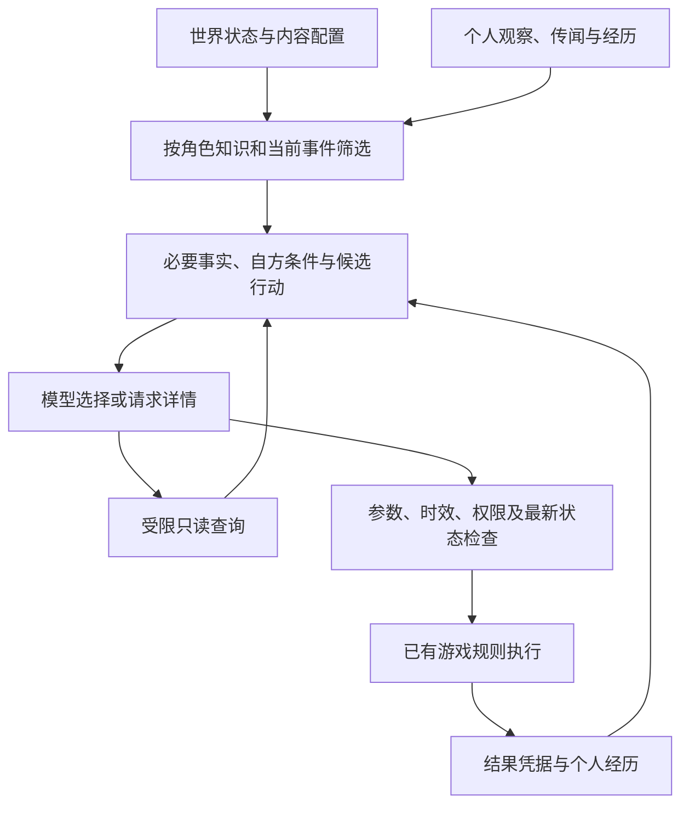

# NPC 环境事实、资源判断与有效上下文

- 日期：2026-09-13；代码基准：`42fcca439c9a0ac59d584d069b7577b906ba940e`。
- 状态：研究建议，供头脑风暴与下一轮实现选择；尚未作为实施 ADR 采用。
- 研究票据：[调研 NPC 环境事实与行动可行性上下文](https://github.com/qinjunw/CozyTown/issues/64)。
- 输入：[12 个完成样本的真实模型评测](../../verification/agent-resource-scenarios-2026-09-13.md)、[Agent 世界 PRD](../../AGENT_WORLD_PRD.md)；一手资料及适用边界见[来源核查](environment-grounding-sources-2026-09-13.md)。本轮只核查资料和代码，没有修改运行代码或新增真实模型调用。

## 1. 结论及当前问题

向 NPC 提供更充分的周边事实可行，尤其适合减少地点、物品与生产经历的无依据叙述。有效上下文应覆盖本次决策所需事实、知识边界和行动条件；增加无关环境细节并不能保证模型更准确。

资源问题已有更直接的证据：此前每轮传入的本人库存、余额和交易条款均与世界状态一致，模型仍有缺鱼时接受、缺钱时请求支付的行为。因此需要分别补齐“事实输入”“条件判断”“输出协议”和“执行检查”，不能将全部失败归因于上下文太少。

| 当前证据 | 能确定的缺口 | 建议处理 |
| --- | --- | --- |
| 台词出现未提供的野生香草、池塘蔬菜、鱼的肥瘦 | 没有这些叙述的事实依据；不能据此断定整个世界里绝不存在相关事物 | 提供可观察事实、明确未确认状态，并约束资源性断言 |
| `social.resources` 已含正确的 `ownedQuantity`、`balance`、`quantity`、`totalPrice` | 事实可用仍可能不被正确用于决策 | 附带宿主计算的本人履约条件与缺口；独立测量其效果 |
| `AllowedOperations` 按会面阶段开放动作 | 阶段允许不等于当时有资源履约 | 区分协议允许、自方条件满足、最终可执行三个判断 |
| 地点查询只有 ID 与可达性；社交请求不开放该查询 | 尚无周围对象、资源特征和来源信息；不能要求模型自行查到 | 为当前社交场景主动装配必需信息，再提供有限详情入口 |
| 1 次邀约候选缺 `planId` | 字段完整性问题，不能靠扩大环境描述解决 | 操作参数校验、受支持的结构输出与有界纠错 |
| 12 轮资产门禁、日程恢复通过 | 证明这组样本中的宿主保护有效，不证明模型判断正确 | 保留最终校验，将模型选择与宿主拦截分开计数 |

代码依据：[资源检查与交换](../../../Assets/CozyTown/Runtime/Application/CharacterResourceTrading.cs)、[决策动作集合](../../../Assets/CozyTown/Runtime/NpcAgents/NpcDecisionRequest.cs)、[地点详情](../../../Assets/CozyTown/Runtime/NpcAgents/NpcLocationDetails.cs)、[请求序列化](../../../Assets/CozyTown/Unity/Npc/ProxyNpcDecisionJsonCodec.cs)。

[当前提示词](../../../Tools/agent_proxy/decision_proxy.py)引导讨论池塘与本地烹饪，禁止编造已完成生产，却没有提供相应的环境事实表。[发言入口](../../../Assets/CozyTown/Runtime/NpcAgents/NpcMeetingBoard.cs)检查发言轮次、到场和长度，未验证台词事实。这解释了“资产正确、叙述仍无依据”可以同时出现；具体提示词措辞是否导致某句编造，仍需对照实验。

## 2. 业界与研究已有的机制

| 一手方案 | 已核查机制 | 对本项目的启示与边界 |
| --- | --- | --- |
| [Convai Environment](https://docs.convai.com/api-docs/plugins-and-integrations/unreal-engine/blueprints-reference/convai-environment) | 注册场景对象、其他角色及可用动作；支持 NPC 间对话的主角色配置 | 环境描述与动作集合由游戏提供；API 能力不等于零编造保证 |
| [SayCan](https://say-can.github.io/) | 结合语言目标相关性与状态相关的技能可行性 | 借鉴“想做什么”和“目前能做什么”分别计算；本项目资源条件可由确定性规则求值，无须复刻机器人价值模型 |
| [Voyager](https://voyager.minedojo.org/) | 把环境反馈、执行错误和验证结果用于后续决策 | 动作结果应反馈给 Agent；其开放代码生成和模型自检并不替代本项目经济规则 |
| [Generative Agents](https://arxiv.org/abs/2304.03442) | 感知、个人记忆检索、规划与社会互动 | 借鉴角色各自知道什么及经历来源；社会行为可信度与交易守恒属于不同评测 |
| [Anthropic 上下文工程](https://www.anthropic.com/engineering/effective-context-engineering-for-ai-agents) | 有选择地提供必要信息，并按需加载细节 | 必要约束直接给，较大详情按需取；工具查询带来额外延迟 |
| [Lost in the Middle](https://arxiv.org/abs/2307.03172) | 所测模型在长上下文检索中受相关信息位置影响 | 上下文容量不能替代有效利用率；论文不是 v4-flash 在本游戏中的测量 |

这些来源支持组合机制，尚不能给出 CozyTown 的预期改善百分比。产品 SDK、研究演示和本地模型实测必须分别记录；归档接口和预览能力的状态详见来源核查。

当前代理使用 DeepSeek 的 `json_object` 输出。[官方 JSON Output](https://api-docs.deepseek.com/guides/json_mode/)提供 JSON 格式约束；[Tool Calls 文档](https://api-docs.deepseek.com/guides/tool_calls/)另列 strict 模式。格式合法、必填字段完整和资源条件成立是三个不同要求；当前服务路径对 strict 能力的兼容性尚未实测，不在本研究中改变模型或端点。

## 3. 建议的事实组织

以下为设计候选，不是已有接口。保留现有调度器、会面板和经济规则，增加一个负责收集、筛选和标注信息的上下文构建模块即可起步。



建议把信息分成以下几类，避免同一个字段既表示世界真相又表示角色猜测：

| 信息类别 | 内容与来源 | 使用约束 |
| --- | --- | --- |
| 本人当前状态 | 自己的物品数量、余额、活动、承诺，来自游戏状态 | 数量与单位直接提供；需要时包含可用量、容量与预留量。预留机制尚未实现 |
| 当前环境观察 | 实际所在区域、可见对象、已观察的状态，来自场景与玩法投影 | 目标地点不能冒充实际位置；植物装饰不能自动成为可采集资源 |
| 已知地点与规则 | 角色已知的地点、配方、能力，来自内容配置及知识授权 | 地点已知不等于当前可见；知道鱼的品类不等于知道池中数量 |
| 历史观察与传闻 | 谁在何时看见或说过什么 | 保留来源和时间；“Ren 说有鱼”不能直接覆盖 Ren 当前库存 |
| 未知与覆盖范围 | 未查询、不可见、未授权，或有限列表的截断状态 | 未列出不等于数量为零；仅在明确完整的查询范围内才能据缺项推断不存在 |
| 执行结果 | 已接受、已到达、交付成功或失败 | 仅用对应结果证明行为；语言中的打算不能自动升级为承诺 |

每条重要事实建议携带来源、观察时间和适用范围；请求携带世界代次与快照标识。当前居民 `revision` 不能被当作所有经济与环境数据的统一版本。后续应让相关事实失效或在提交时重读；库存、路线、对话中的历史信息具有不同更新速度，不宜共用一个任意固定 TTL。

静态配方、设定与较长记忆可以按需检索。实时库存、余额和资源数量优先从游戏状态按 ID 直接读取，避免拿语义检索命中的旧叙述作为当前数值。四名 NPC 的规模尚无必须引入向量数据库或知识图谱的证据。

## 4. 资源条件需要怎样表达

以 Sora 有 10 金币、固定价款为 25 为例，建议同时提供原始数值与可复核的派生结果：

```json
{
  "self": {"ownedFish": 0, "coins": 10},
  "terms": {"fishRequired": 1, "totalPrice": 25},
  "selfAssessment": {
    "canPay": false,
    "missingCoins": 15,
    "reason": "wallet.insufficient_funds"
  },
  "partnerStock": {"knowledge": "unknown"}
}
```

此片段仅用于讨论，未替换现有协议。数值、缺口与原因由宿主根据相同规则产生，模型据此选择符合角色动机的行动。Ren 缺鱼时应获得自己的缺货结论；Sora 不能因此自动知道 Ren 的私有库存。

需要明确三个判断：

1. **当前协议允许**：这个会面阶段是否接受某种操作。
2. **本人条件满足**：按照本人已知资源和固定条款，目前是否有能力履约；对方情况可以是未知。
3. **提交时可执行**：宿主读取最新双方状态，检查到场、资源、容量与并发变化后，是否能实际完成动作。

不要向 Sora 提供由 Ren 私有库存算出的全局 `canTrade`，也不要据此静默移除选项，使她通过选项变化推知对方资产。自方条件可以直接披露；对方意愿与能否供货，可经明确答复获知。供货答复是对方的声明，仍需执行时验证。

当前只有固定价交易，没有赊账、借钱或未来生产承诺。建议这一路径在自方已知条件不足时选择等待、拒绝或取消；若要允许“先约好、之后想办法凑齐”，应另行定义期限、条件性承诺及替代行动，否则容易把不同玩法语义误判为模型失败。

## 5. 渐进式披露与自动触发

第一层每次直接给身份、当前事件、目标、时间、实际位置、相关资源、条款、自方条件及合法候选。买鱼决策中的余额和价格不能藏在工具后面，等待模型偶然查到。

第二层按事件装配周边相关信息：邀约涉及对象和会面地点；到场交谈涉及双方刚确认的交付及当前可观察景物；考虑料理时才需要授权菜谱。可见对象列表用明确的相关性与条数预算裁剪，并说明是否完整。

第三层由模型在已知对象中请求详情，例如未来的 `inspect(entityId, facet)`、`recall(topic, limit)` 或资源条件预览。名称为候选；现有 `inspect_location` 仅覆盖地点可达性，尚无这些能力。查询只读、带权限与快照标识，允许次数计入一次决策的总预算；预算不足时使用已知信息选择回退。

自动运行继续由需求变化、收到邀请、到场、相关资源变化或执行失败等游戏事件驱动。程序先形成任务和初始上下文，模型才按需展开；不依赖玩家输入自然语言。资源变化仅在影响当前目标或承诺时唤醒，并沿用事件合并、冷却和并发上限。

## 6. 如何保留表达自由并减少事实编造

建议区分资源断言与个人表达。数量、地点存在性、物品来源、行动完成和具体预约必须对应事实或结构化记录；喜好、情绪、礼貌、假设和明确标记的愿望可以保留变化。例如“我喜欢鱼汤”不证明已经煮汤，“池边长着可采的香草”则需要环境证据。

可先给交谈提供少量带来源的事实与已确认话题，并允许回答“不清楚”。若关键数值仍被说错，可让模型选发言意图及事实引用，由模板生成数字、物品名和交付结果。模板会限制表达空间，应只覆盖需要精确含义的部分。

仅要求返回 `factIds` 不能保证自由台词忠实引用事实；模型可以引用正确事实却说错内容。自由表达仍需语义评测，自动评审模型只能辅助发现问题，不能替代宿主资产规则或提供完全消除编造的保证。

## 7. 下一轮怎样验证

先通过公开上下文、决策与经济入口验证事实投影及权限，再进行有版本的真实模型比较。本节是实验建议，本轮未执行。

| 实验组 | 改变什么 | 回答的问题 |
| --- | --- | --- |
| A：当前版本 | 原提示词与披露 | 新实验时段的基线；历史 12 轮作为参考 |
| B：补充相关事实 | 增加环境事实、来源及未知状态，保留动作集合 | 增加有效信息能否减少无依据叙述 |
| C：明确自方条件 | 在 B 上增加规则算出的资源缺口和可行性，保留动作集合 | 明示条件能否减少模型的错误邀约与接受 |
| D：自方条件过滤 | 在 C 上过滤当前玩法中已知不满足条件的行动 | 测量系统拒绝率、调用量和体验；过滤产生的改善不得计为模型推理改善 |

先用固定请求集比较 A/B/C 的首个选择，避免双方互相影响掩盖原因；再让双方都用真实模型运行完整流程。相同初始配置并不保证后续轨迹相同，比较应分别报告首决策与整轮结果。D 单列系统策略效果。若要专门回答“更长是否更好”，增加同样事实但混入无关地点说明的压力组，并控制事实内容与调用参数。

复用资源充足、卖方缺鱼、买方缺钱、买方已有鱼四种配置，每组重复至少 5 次作为初筛，不用于宣称长期可靠率。新增边界包括价款前后 1 金币、库存 0/1/2、满包、已知地点不可达、旧库存记忆与新快照冲突、等待响应时资源变化、未授权对方资产、成功前后交付表述。环境用例分别设置“确实不存在”“不可见而未知”和“装饰存在但不可采集”。

指标分开报告：首轮资源选择错误率、无依据事实断言数、未知信息处理、协议完整率、宿主拦截数、实际交付与恢复、Token 和延迟。自由台词保留原文及所依赖事实，区分矛盾、无依据、明确猜测与个人偏好；抽样人工复核，避免以语言流畅代替正确。

每轮重新初始化双方资产、世界、承诺与记忆；固定模型请求名及参数，记录实际返回别名、提示词和上下文版本、候选与执行结果。场景种子不等于模型采样种子，测试顺序应交错；模型若无可控采样种子需明确记录。中断、无效候选和纠错调用全部保留并计费；预算与重复次数在启动前锁定。

## 8. 工作指导与待讨论选择

建议先完成自方资源条件披露和参数校验，再接入局部环境事实，最后增加对方供货询问、较长记忆检索与跨日验证。这样每一步都能用既有失败场景判断收益。研究结论分别输入 [明确资源不足时的邀约与答复策略](https://github.com/qinjunw/CozyTown/issues/62) 和 [校验邀约候选必填字段并限定纠错机会](https://github.com/qinjunw/CozyTown/issues/63)，不将本轮研究视为这两项实现已完成。

后续头脑风暴主要需要选择：NPC 感知按区域还是视线定义；哪些资源事实可以经交谈共享；关键事实使用模板到什么程度；是否引入条件性承诺。当前研究推荐从已有区域、本人资源与固定交易开始，尚未决定这些扩展玩法；具体讨论入口为 [确定 NPC 局部观察与事实表达的边界](https://github.com/qinjunw/CozyTown/issues/65)。
